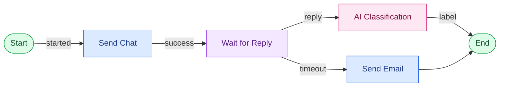

# Pengenalan Simulation Builder

## Apa itu Simulation Builder?

**Simulation Builder** adalah area Studio untuk membuat Simulation secara visual. Anda menyusun beberapa Node di canvas, mengisi konfigurasi, lalu menghubungkan Output Port satu Node ke Input Port Node berikutnya.

## Istilah yang digunakan

| Istilah | Arti sederhana |
|---|---|
| Simulation | Skenario utama yang ingin dijalankan. |
| Version | Versi dari sebuah Simulation yang berisi graph workflow. |
| Workflow | Urutan langkah yang dijalankan oleh Simulation. |
| Node | Satu langkah dalam workflow, misalnya mengirim chat atau menunggu balasan. |
| Input Port | Titik masuk untuk menerima alur dari Node sebelumnya. |
| Output Port | Titik keluar yang menentukan jalur berikutnya. |
| Connection / Edge | Garis penghubung dari Output Port ke Input Port. |
| Actor | Karakter atau pihak yang berinteraksi dengan participant. |
| Participant | Orang yang menjalankan atau mengikuti Simulation. |

## Bagaimana workflow berjalan?

Workflow dimulai dari `Start`, mengirim chat, lalu menunggu balasan. Jika balasan diterima, respons dapat diklasifikasikan. Jika waktu tunggu habis, workflow dapat mengirim email follow-up.

## Cara membuat Simulation

1. Buat Simulation dan isi nama serta deskripsinya.
2. Buat atau buka Version.
3. Tambahkan `Start` sebagai titik awal.
4. Tambahkan Node sesuai skenario.
5. Pilih Node untuk membuka panel konfigurasi.
6. Isi field yang wajib dan pilih resource dari picker bila tersedia.
7. Tarik garis dari Output Port ke Input Port Node tujuan.
8. Pastikan cabang `failed`, `timeout`, atau hasil lain memiliki tujuan yang sesuai.
9. Tambahkan `End` pada jalur yang selesai.
10. Jalankan validasi sebelum menggunakan Simulation.

## Memahami warna diagram

Dokumentasi ini memakai warna yang konsisten agar alur mudah dibaca:

- Biru: action atau communication.
- Ungu: wait atau timer.
- Kuning: pemeriksaan, kondisi, atau flow control.
- Pink: AI atau classification.
- Hijau: Start, End, atau hasil selesai.
- Merah: error atau jalur `failed`.
