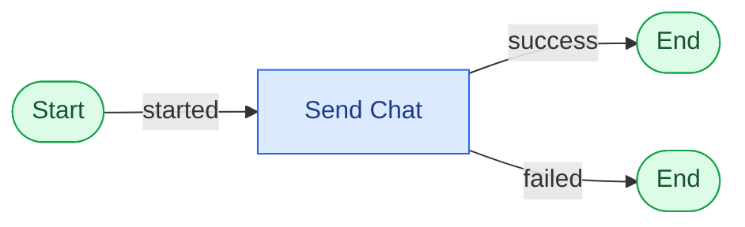
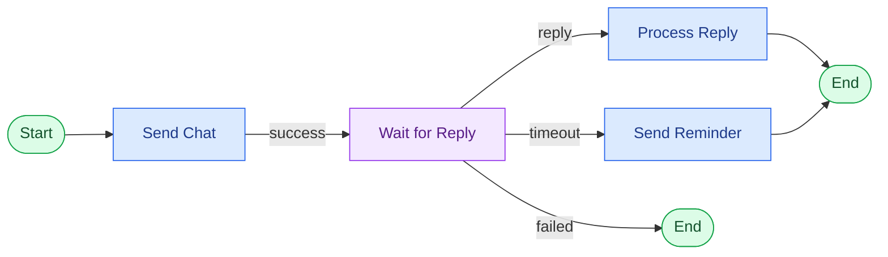
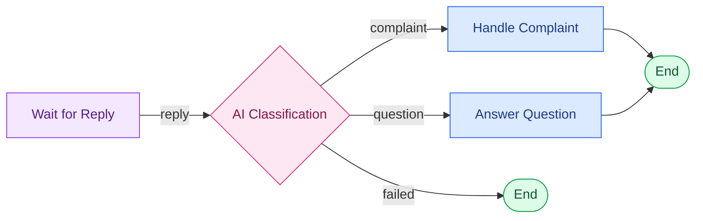
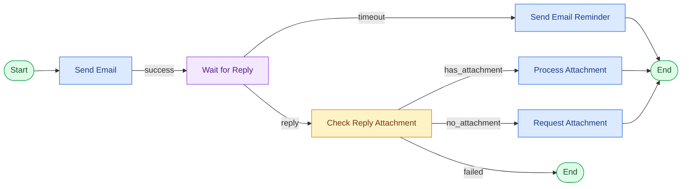

# Contoh Workflow

Semua contoh di bawah hanya menggunakan Node yang tersedia.

## Contoh 1 — Percakapan sederhana

Workflow dimulai dari `Start`, mengirim chat, lalu selesai pada hasil `success` atau `failed`.

## Contoh 2 — Menunggu respons participant

Setelah chat terkirim, workflow menunggu balasan. Balasan diproses, sedangkan timeout dapat menjalankan reminder.

## Contoh 3 — Percabangan berdasarkan classification

`AI Classification` menyediakan port sesuai label yang dikonfigurasi. Masing-masing label dapat diarahkan ke penanganan berbeda.

## Contoh 4 — Follow-up email

Workflow mengirim email, menunggu balasan email, lalu memeriksa attachment. Balasan tanpa attachment dapat diarahkan ke permintaan attachment tambahan.
